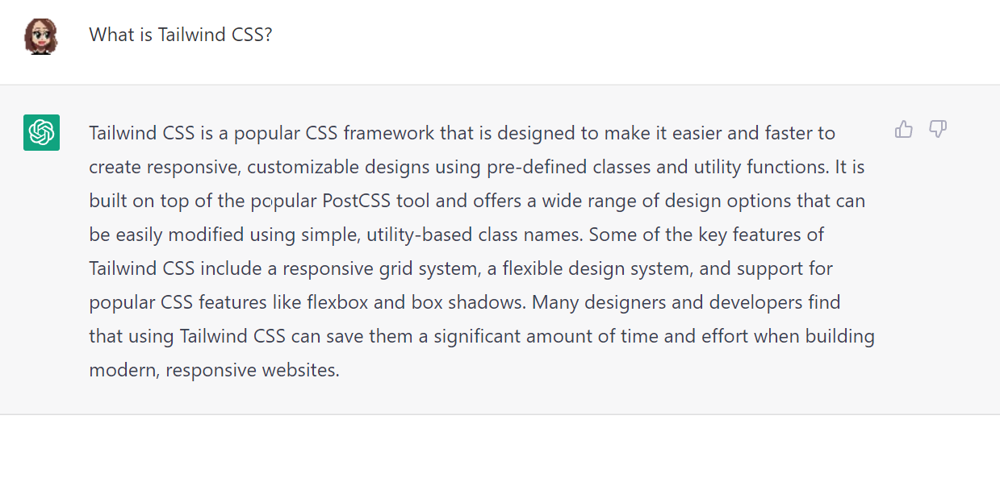

# Ankademin Cafe
##### Henrik Berglund FEND22

:::{.megaemoji}
🦆
:::

---

# Kommer prata om:

- Lite om koncept {."fragment"}
- Demo av sidan (+Lighthouse) {."fragment"}
- Kort om Svelte, SvelteKit och Tailwind {."fragment"}
- Visa JS-funktionalitet (dark mode) {."fragment"}
- Utmaningar {."fragment"}
- Lärdomar {."fragment"}

---

# Koncept: kattkafe fast ankor!
- ett kafe där man kan umgås med ankor {."fragment"}
- färger är lite andinspirerade {."fragment"}
- bilder är genererade med AI (stable diffusion) {."fragment"}

---

# Demo av sidan + Lighthouse

---

# Svelte

#### Ett JavaScript-ramverk

```html

<script>
	let name = "world";
</script>

<h1>Hello {name}!</h1>

<style>
	h1 { 
    color: red;
  }
</style>

```

#  Hello world!{style=color:red}

--

# Svelte
#### Komponenter

- Små .svelte-filer med JS, HTML och CSS{."fragment"}
- skrivs med stor bokstav i början t.ex Button.svelte för att skilja mot vanliga HTML-taggar {."fragment"}
- kan återanvända komponenter i sin sida {."fragment"}
- CSS är scopat till komponenten så man behöver inte oroa sig om krockar {."fragment"}

--

# Svelte
#### Jag gillar det för det är:
- enkelt att förstå {."fragment"}
- inte i vägen (man kan bara skriva HTML om man vill) {."fragment"}
- lätt att trycka in lite JS i sin markup (t.ex variabler, loopar etc) {."fragment"}
- lite kod ger stor effekt (med kompilering) {."fragment"}
- bra performance {."fragment"}
- bra tutorial! https://svelte.dev/tutorial/basics {."fragment"}

---

# SvelteKit

#### Metaramverk (???)

- Gjort för att man enkelt ska kunna bygga och hosta hemsidor {."fragment"}
- Byggt för att maximera prestanda, SEO etc {."fragment"}
- Release candidate för version 1.0 {."fragment"}
- Fullstack (kan kombinera sin Svelte-frontend med backend) {."fragment"}

---

# SvelteKit

#### Routing (???)

Om jag vill ha en undersida /about {."fragment"}

1. Gör en mapp som heter **about** under **routes** i **src** {."fragment"}
2. Skapar en fil +page.svelte i **about**-mappen {."fragment"}
3. Lägger till HTML, JS (om det behövs) {."fragment"}
4. Klart! {."fragment"}

---

# SvelteKit

#### Layout (???)

Om jag vill ha t.ex en nav på alla sidor

:::{.element style=font-size:2rem}
1. Skapar en fil +layout.svelte i routes-mappen {."fragment"}
2. Lägger till HTML, JS (om det behövs) t.ex `<nav>`-tagg {."fragment"}
3. Lägger till `<slot/>` som blir en låda där man stoppar i en +page.svelte {."fragment"}
4. Klart! {."fragment"}
:::

I min +layout.svelte hade jag header, breadcrumbs, div med transition runt slot, footer {."fragment"}

---

# Tailwind CSS

## Ett CSS-ramv... ?

 {."fragment"}

---

# Tailwind CSS

## Varför Tailwind istället för Bootstrap?

### Jag frågade ChatGPT (gav en bra review för mitt kafe så)

---

# Tailwind CSS vs Bootstrap

:::
1. Mer fokuserat på "utility classes" (t.ex p-4) och mindre fokus på "klara komponenter" = mer flexibelt och customizable {."fragment"}
2. Byggt på PostCSS = kan enkelt extenda {."fragment"}
3. Mindre opinierat än Bootstrap och kommer inte med en klar design (bara färger) = enklare att göra olika designs utan att behöva overrida default styles {."fragment"}
4. Mindre och snabbare än Bootstrap och kan enkelt integreras i olika projekt och ramverk {."fragment"}
:::

--

Overall: mer flexibelt och en mer customizable approach än Bootstrap

---

# Tailwind CSS

## Vad tyckte jag?

- Gillade mer ju mer jag använde {."fragment"}
- Kunde stänga av hjärnan och bara enkelt prova mig fram tills jag blev nöjd {."fragment"}
  - behöver inte komma på namn på klasser {."fragment"}
  - behöver inte oroa mig om kollisioner {."fragment"}
  - behöver inte gå till en .CSS-fil {."fragment"}
  - kändes framförallt smidigt och enkelt: färre
   saker att oroa sig för {."fragment"}
   
---

# Tailwind CSS

{style=width:50%}

---

# Tailwind CSS

 prettier-plugin-tailwindcss : Prettier-plugin som sorterar klasser{style=font-size:2rem}

:::{.element class="fragment"}
```html
<!-- Before -->
<button class="text-white px-4 sm:px-8 py-2 sm:py-3 bg-sky-700 hover:bg-sky-800">...</button>
``` 
:::


:::{.element class="fragment"}
```html
<!-- After -->
<button class="bg-sky-700 px-4 py-2 text-white hover:bg-sky-800 sm:px-8 sm:py-3">...</button>
```
:::

 {."fragment"}

---

# Utmaningar

## Jobba själv {."fragment"}
- saker tar tid {."fragment"}
- är förvirrad ensam, har ingen att bolla med {."fragment"}
- lite tråkigt för inga git merge conflicts {."fragment"}

---

# Utmaningar

## Buggar {."fragment"}

- har spenderat x antal timmar att leta/fixa buggar {."fragment"}
- tomt srcset-attribut = sidan bygger inte längre {."fragment"}
- 404-sidan fungerar lokalt men inte på Github Pages (???) {."fragment"}
- största problemet: oklara felmeddelendan/oklart vad det ens är för fel {."fragment"}

---

# Utmaningar

## Design/responsivitet/accessibility

- fortfarande lite ovant! {."fragment"}
- men fanns bra verktyg (t.ex Lighthouse, Accessibility insights for the web, w3c-validering) {."fragment"}

---

# Lärdomar

- Svelte+SvelteKit+Tailwind kändes som bra kombo + kul! {."fragment"}
- Använda Lighthouse för att få nära 100 poäng {."fragment"}
- Accessibility insights for the web för att hitta problem runt tillgänglighet med sidan {."fragment"}
- w3c markup validation service för att hitta problem i sin markup {."fragment"}
- saker som är bra att veta till nästa gång t.ex .webp > .jpg, svg för ikon > 200kb font, mobiler har högre pixel density etc {."fragment"}

---

# Lärdomar

framför allt att kombinera allt detta till en riktig webbsida med många undersidor + lite trevlig JS-funktionalitet 👍 {."fragment"}

---

# Tack för att ni har lyssnat!

Frågor?

🦆{.megaemoji}


